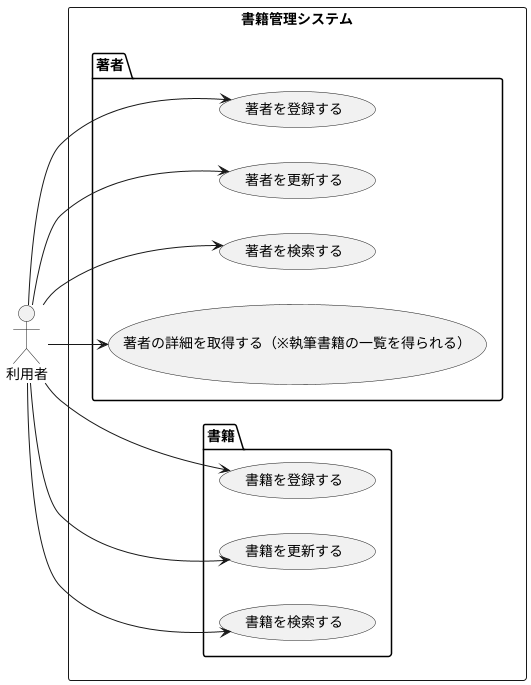

## 課題要求
- 書籍管理システム
- 書籍には著者の属性があり、書籍と著者の情報をRDBに登録・変更・検索ができる
- 著者に紐づく本を取得できる

【補足】
- APIのみ（※Viewはなし）
- テストコード付

### 想定ユースケース

## 前提事項

観点
> 参照透過性を意識した安全性の高いコードをKotlinで書けるかどうか

そこを外れる部分は基本的に簡素化しています。

機能設計的な部分も私個人で都合よく解釈させていただいております。

具体的には、
- バリデーションやロギング・例外ハンドリングは今回は観点の外として省略しています。
- gradleの設定周りもひとまず動くもの以上のことは目指していません。
- アーキテクチャーは仮にDDDっぽくやるならという体です。
- ライブラリを合わせてJOOQをO/Rマッパーに初めて採用してみました。
  - こちらは知見等からよりよい記述や設計がありましたらご教授（プルリクでも何でも）いただけると嬉しく思います。
    - 特に悩んだ部分
      1. 検索系の条件の部分的な共通化をどうするのが良いのか？共通化しない方がいいのか？上手く部分適用できないか？
      2. 割と記述に自由度がありすぎて統一感どう出しているのか？どうゆうルールに寄せているのか？

## 課題

- テストコンテキスト起動時にH2へのインサート処理が複数回走っている模様（現状：原因調査間に合わず・・）